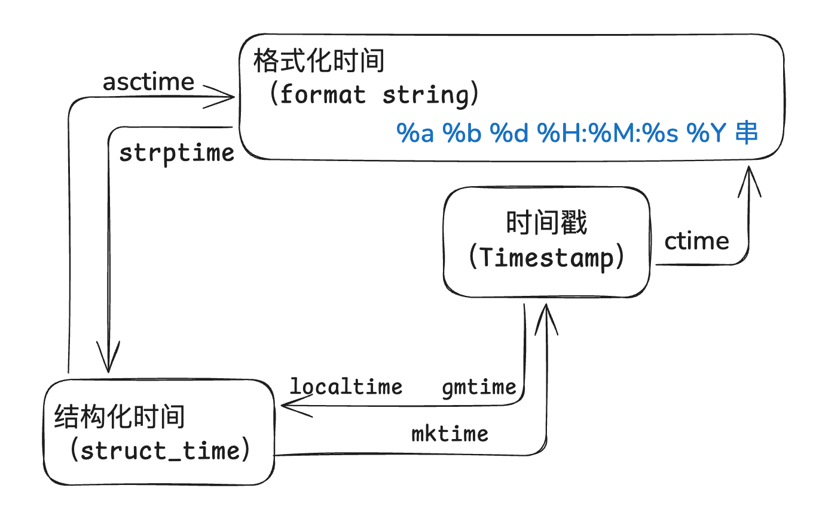

## collections模块

> 在内置数据类型(dict、list、set、tuple)的基础上，collection模块还提供了几个额外的数据类型：`Counter`、`deque`、`defaultdict`、`namedtuple`和`orderedict`

数据类型|说明
---|---
`namedtuple`|生成可以使用名字来访问的元素内容的tuple
`deque`|双端队列，可以快速的从另一侧追加和推出对象
`counter`|计数器，主要用来计数
`orderdict`|有序字典
`defaultdict`|带有默认值的字典

### 1.`namedtuple`
```python
from collections import namedtuple
point = namedtuple('point',['x','y']) # 创建namedtuple数据类型
p = point(1,2)  # 创建实例
print(p.x,p.y)  # 输出 1 2，通过字段名访问
```

### 2.`deque`
> 1. 使用`list`存储数据时，按索引访问元素很快，但插入和删除元素很慢（list是线性存储，数据量大的时候插入删除效率很低）
> 2. `deque`是为了高效实现插入和删除操作的双向列表，适合于队列和栈

```python
from collections import deque

q = deque(['a','b','c'])
q.append('m')  # 在尾部增加`m`
print(q)
q.pop()        # 删除尾部的元素
q.appendleft('u') # 头部添加 `u`
print(q)
q.popleft()    # 头部删除
print(q)
"""
输出
deque(['a', 'b', 'c', 'm'])
'm'
deque(['u', 'a', 'b', 'c'])
'u'
deque(['a', 'b', 'c'])
"""
```
### 3.`orderdict`
> 按照插入的顺序排序，不是key本身（python3.6版本之前普通字典完全无序，键值顺序由哈希表存储方式决定）

```python
d1 = {'a':1,'b':2}
d2 = {'b':2,'a':1}
print(d1 == d2)   # 输出 True ，内容相同即相等

from collections import OrderedDict
ord1 = OrderedDict([('a',1),('b',2)])
ord2 = OrderedDict([('b',2),('a',1)])
print(ord1 == ord2)  # 输出 False，有序字典顺序需要进行比较
```
### 4.`defaultdict`
> 键不存在时，自动生成默认值。普通dict键不存在时抛出KeyError异常（需要频繁处理缺失键）
#### 基本用法
```python
from collections import defaultdict
defaultdict(list)  # 值类型为列表(分组)
defaultdict(set)  # 值类型为集合(去重)
defaultdict(int)  # 值类型为整数(计数)
```
#### 案例1:计数器的实现
参考对应案例文件（有经典写法和defaultdict写法）

#### 案例2:统计单词首字母分组

#### counter
> counter类出现的目的是用来跟踪值出现的次数。它是一个无序的容器类型，以字典的键值对形式存储，其中元素作为key，其计数作为value
```python
from collections import Counter
c = Counter('qaasccwcqwcwqcfrg')
print(c)
```

## 时间相关的模块
### time模块
> 常用方法
- time.sleep(secs):(线程)推迟指定的时间运行。单位为秒
- time.time():获取当前时间戳

在python中，通常有三种方式来表示时间（时间戳、结构化时间和格式化时间）
- 时间戳：通常来说：时间戳表示的是从1970年1月1日00:00:00开始按秒计算的偏移量,如`1747114142.79492`
- 格式化时间：如`1999-12-06`
- 结构化时间：`time.struct_time(tm_year=2025,tm_mon=5,tm_mday=13.tm_hour=13,tm_min=29,tm_sec=54,tm_wday=1,tm_yday=133,tm_isdst)`

#### 相关符号
1. 格式化时间
常见符号的含义

符号|含义
---|---
`%y`|两位数的年份表示
`%Y`|四位数的年份表示
`%m`|月份（01-12）
`%d`|月内的某一天（0-31）
`%H`|24制小时数(0-23)
`%I`|12小时制小时数(01-12)
`%M`|分钟数（00-59）
`%S`|秒（00-59）
`%a`|本地简化星期名称
`%A`|完整显式星期名称
`%b`|本地简化的月份名称
`%B`|本地完整的月份名称
`%c`|本地相应的日期表示和时间表示
`%j`|年内的一天（001-366）
`%p`|本地`A.M.`或`P.M.`的等价符
`%U`|一年中的星期天（00-53）星期天为星期的开始
`%w`|星期（0-6），星期天为星期的开始
`%W`|一年中的星期数（00-53）星期一为星期的开始
`%x`|本地相应的日期表示
`%X`|本地相应的时间表示
`%Z`|当前时区的名称
`%%`|`%`号本身


2. 结构化时间相关符号 

索引|属性名|值（举例）|有效范围|作用说明
---|---|---|---|---
0|`tm_year`|2011|`1970~...`|年份（四位数）
1|`tm_mon`|12|1 ~ 12|月份（1=一月，12=十二月）
2|`tm_mday`|31|1 ~ 31|一个月中的第几天
3|`tm_hour`|23|0 ~ 23|小时（24小时制）
4|`tm_min`|59|0 ~ 59|分钟
5|`tm_sec`|59|0 ~ 60|秒（60 用于闰秒）
6|`tm_wday`|0|0 ~ 6	|星期几（0=周一，6=周日）
7|`m_yday`|365|1 ~ 366|一年中的第几天
8|`tm_isdst`|0|-1, 0, 1|是否夏令时（-1=未知，0=否，1=是）



#### 详情见对应案例文件

### datetime模块

> 某种情况下，需要写定时任务（比如几分钟后，几秒前）这种情况下用time模块不好操作。这时候可以使用`datetime`模块来完成操作
适合日期计算、时区处理和格式化等场景

#### 核心类

类名|说明
---|--
`datetime.date`|日期（年、月、日），不含时间
`datetime.time`|时间（时、分、秒、微秒），不含日期
`datetime.datetime`|日期+时间
`datetime.timedelta`|两个时间之间的差值
`datetime.timezone`|时区信息

