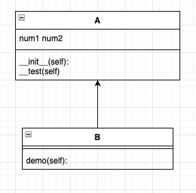

## 继承
> 子类可以复用父类的属性和方法，并扩展新功能，实现代码复用和逻辑分层。（如电动车类继承自汽车类，新增充电方法）
1. 创建对象（不用继承）
```python
class Person:
    def __init__(self,name,sex,age):
        self.name = name
        self.age = age
        self.sex = sex
class Cat:
    def __init__(self,name.sex,age):
        self.name = name
        self.age = age
        self.sex = sex
class Dog:
    def __init__(self,name,sex,age):
        self.name = name
        self.age = age
        self.sex = sex
```
2. 创建对象（使用继承）

```python
class Animal(object):
    def __init__(self,name,age):
        self.name = name
        self.age = age
    def eat(self):
        print(f"{self.name}吃东西...")
class Dog(Animal):
    pass

xiaotianquan = Dog("哮天犬",5)
xiaotianquan.eat()   # 输出 哮天犬吃东西....
```
### 继承的优点
- 增加了类的耦合性(耦合性不宜多，宜精)
- 减少了重复代码
- 代码更加规范化，合理化

### 继承分类
> python中类的种类可以分为新式类和经典类
- 经典类是指没有显式继承自object的类。他们使用旧的类定义方式
- 新式类是指显示继承自object或其他新式类的类

#### 单继承

##### 对象执行父类方法
人、猫、狗继承动物类

##### 方法重写
- 在开发中，父类的方法实现和子类的方法实现完全不同，可以使用覆盖的方式，在子类中重新编写父类的方法实现
- 具体的实现方式，相当于在子类中定义了一个和父类同名的方法并且实现
- 重写之后，在运行时只会调用子类中重写的方法，而不再会调用父类封装的方法

##### 子类中扩展父类的方法
- 子类中的实现方法中包含父类的方法实现 且 父类原本封装的方法实现是子类方法的一部分
- 可以使用
    1. 在子类中重写父类的方法
    2. `super().父类方法`来调用父类方法的执行
    3. 代码其他位置针对子类的需求，编写子类特有的代码实现

##### 父类的私有属性和私有方法
子类对象不能在自己的方法内部，直接访问父类的私有属性或私有方法，但可以通过父类的公有方法间接访问
- 私有属性（私有方法）是对象的隐私，不对外公开，外界以及子类都不能直接访问
- 私有属性（私有方法）通常用于做一些内部的事情


> B的对象：不能直接访问__num2__属性、不能在demo方法内访问__num2属性、B的对象可以在demo方法内部，能够访问__num2属性和__test方法

#### 多继承
> 一个子类同时继承多个父类，并且具有所有父类的属性和方法(如孩子会继承自己父亲和母亲的特性)

##### 方法解析顺序(MRO)
> 当多个父类有同名方法时，Python MRO(Method Resolution Order)


## 多态
> 同一方法在不同对象中呈现不同行为，增强代码灵活性（例如动物类的发声方法在猫狗对象中过分别输出汪汪和喵喵）
- 多态可以增强代码的灵活性
- 以继承和重写父类方法为前提
- 是调用方法的技巧，不会影响到类的内部设计

### 切入案例


### 哮天犬案例
> 需求
1. 在Dog类中封装方法game
2. 定义Xiaotianquan继承自Dog，并且重写game方法
3. 定义person类并且封装一个和狗玩的方法
