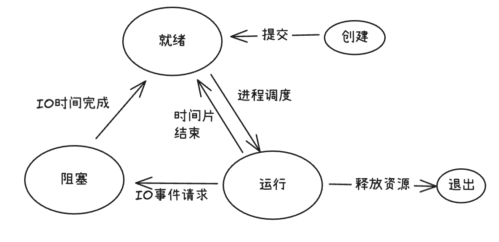

## 进程概述
进程是计算机中的程序关于某数据集合上的一次通行活动，是**系统进行资源分配和调度的基本单位**，是操作系统结构的基础
在早期面向进程设计的计算机结构中，进程是程序的基本执行实体；在当代面向线程设计的计算机结构中，进程是线程的容器
程序是指令、数据及其组织形式的描述，进程是程序的实体
- 狭义定义
   进程是正在运行的程序的实例
- 广义定义
   进程是一个具有一定独立功能的程序关于某个数据集合的一次运行活动。它是操作系统动态执行的基本单元，在传统的操作系统中，进程既是基本的分配单元，也是基本的执行单元

1. 进程是一个实体
   每一个进程都有它自己的地址空间，一般情况下，包括文本区域、数据区域和堆栈。
   文本区域存储处理器执行的代码；数据区域存储变量和进程执行期间使用的动态分配的内存；堆栈区域存储着活动过程中调用的指令和本地变量
2. 进程是一个执行中的程序
   程序是一个没有生命的实体。只有处理器赋予程序生命时（即操作系统执行之时），它才能成为一个活动的实体，我们称之为“进程”
   进程是操作系统中最基本、最重要的概念。他是多道程序系统出现后，为了刻画系统内部出现的动态情况，描述系统内部各道程序的活动规律引进的一个概念，所有多道程序设计操作系统都建立在进程的基础上

## 进程调度方式
> 想要多个进程交替运行，操作系统必须对这些进程进行调度，调度不是随机进行的，而是需要遵循一定的法则，这些法则叫做进程的调度算法
### 先来先服务调度（FCFS/First-Come/First-Served）
先来先服务调度算法是一种简单的调度算法，该算法既可用于作业调度，也可用于进程调度。
FCFS算法比较有利于长作业（进程），而不利于短作业（进程）
该算法适用于CPU繁忙型作业（进程），而不利于I/O繁忙型的作业（进程）

### 短作业优先调度（SJF,Shortest Job First）
短作业（进程）优先调度算法是指对短作业或短进程优先调度的算法，该方法既可用于作业调度，也可用于进程调度
SJF算法对长作业(进程)不利；不能保证紧迫性作业(进程)被及时处理;作业的长短只是被估算出来的

### 最高优先级调度（Priority Scheduling,PS）
每个进程被赋予一个优先级。系统总是选择优先级最高的进程执行
若两个进程有相同优先级，则可以按照FCFS调度

### 时间片轮转调度(Round Robin,RR)
时间片轮转法的基本思路是让每个进程在就绪队列中的等待时间和享受服务的时间成比例
    在时间片轮转法中，需要将CPU的处理时间分成固定大小的时间片
        例如，几十毫秒至几百毫秒，如果一个进程在被调度选中之后用完了系统规定的时间片，但又未完成要求的任务，则它自行释放自己所占有的CPU而排到就绪队列的末尾，等待下一次调度。同时进程调度程序又去调度当前就绪队列中的第一个进程。
    轮转法只可以用来调度分配一些可以抢占的资源。这些可以被抢占的资源可以随时被剥夺，而且可以将他们在分配给别的进程。
    CPU是可抢占资源的一种；但打印机等资源是不可抢占的
    由于作业调度是对除了CPU之外的所有系统硬件资源的分配，其中包括不可抢占资源，所以作业调度不能使用时间片轮转法
在轮转法中，时间片长度的选取非常重要
    时间片长度的选择会直接影响到系统的开销和响应时间
    如果时间片长度过短，则调度程序抢占处理机的次数增多。这将使得进程切换上下文的的次数大大增加，从而加重系统开销
    如果时间片长度过长，则轮转法变成了先来先服务算法（假设一个时间片能保证就绪队列中所需执行时间最长的进程能执行完毕）
    时间片长度的选择是根据系统对响应时间的要求和就绪队列中所允许最大的进程数来确定的

### 多级反馈队列调度（Multilevel Feedback Queue，MLFQ）
无论是FCFS算法、SJF算法、PS算法还是RR算法，它们都有一定的局限性
而多级反馈调度算法则不必事先知道各种进程所需的执行时间，而且还可以满足各类类型进程的需要，因而它是目前被公认的一种较好的进程调度算法
在采用多级反馈队列调度算法的系统中，调度算法的实施过程如下所述

1. 设置多个就绪队列，并为各个队列赋予不同的优先级
   第一队列的优先级最高，第二队列次之，其余各队列的优先级逐个降低。该算法赋予各个队列中进程执行时间片的大小也各不相同，在优先级较高的队列中，为每个进程所规定的执行时间片就越小
    例如，在第二个队列的时间片要比第一个队列的时间片长一倍，...，第i+1个队列的时间片要比第i个队列的时间片长1倍
2. 当一个新的进程进入内存后，首先将它放入第一队列的末尾，按照FCFS原则排队等待调度。当轮到该进程执行时，如他能在该时间片内完成，便可准备撤离系统；如果它在第一个时间片结束尚未完成，调度程序便将该进程转入第二队列的末尾，同时再按照FCFS原则按照调度执行；如果它在第二队列中运行一个时间片后仍未完成，再依此将它放入第三队列，...，如此下去，当一个长作业从第一个长作业从第一队列依次降到第n队列后，在第n队列便采取按时间片轮转的方式运行
3. 仅当第一队列空闲时，调度程序才调度第二队列中的进程运行；仅当第1～（i-1）队列均空时，才会调度第i队列中的进程运行
   如果处理机正在第i队列中为某进程服务时，又有新的进程进入优先权较高的队列(第1～（i-1）中的任何一个队列)，则此时新进程将抢占正在运行进程的处理机，即由调度程序把正在运行的进程放回到第i队列的末尾，把处理机分配给新到来的高优先权进程

## 进程的并行与并发
并行：指两者同时执行，比如赛跑，两个人都在不停的往前跑（资源够用，比如三个线程、四核CPU）
并发：在资源有限的情况，两者交轮流使用资源，比如一段里（单核CPU资源）同时只能过一个人，A走一段后，让给B，B用完后继续给A，交替使用，目的是提高效率

> 并行 是从微观上，也就是在一个精确的时间片时刻，有不同的程序在执行，这就要求必须要有多个处理器
> 并发 是从宏观上，在一个时间段上可以看出是同时执行的，比如一个服务器同时处理多个session

## 同步异步阻塞非阻塞

### 进程状态介绍
#### 进程三态


- 就绪(Ready)状态: 进程已分配到除CPU以外的所有必要的资源，只要获得处理机便可立即执行，此时进程的状态称为就绪状态
- 执行/运行（Running）状态：进程已获得处理机，其程序正在处理机上执行，此时的进程状态称为执行状态
- 阻塞状态(Blocked)状态：正在执行的进程，由于等待某个事件发生而无法执行时，便放弃处理机而处于阻塞状态。引起进程阻塞的事件可以有多种（如I/O等待、申请缓冲区不能满足、等待信号等）


### 进程的同步
> 多个进程在执行时，需要协调彼此的顺序或时机，以确保共享资源被正确访问，避免数据混乱
#### 同步的核心目的
- 防止竞争条件
- 保证数据一致性

#### 常见场景
- 多个进程同时写相同文件
- 多个进程操作同一个共享内存变量（如计数器）

#### 同步的特点
- 有等待：一个进程可能要等另一个进程完成某操作后才能继续
- 有序性：执行顺序受控

#### 同步的例子
> 两个进程同时给银行账户余额+100元（初始为0）
> 如果不加同步，最终余额可能是100（而非200），因为两者都读到0，各自加100后写回
> 使用互斥锁（Mutex）同步后，一个进程完成后再让另一个操作，结果就是正确的200

### 进程的异步
> 进程发起一个操作后，不再需要等待它完成，可以立即继续做其他事情。操作的结果通过回掉、信号、消息等方式later通知

#### 核心目的
- 提高并发性和响应速度
- 避免阻塞

#### 常见场景
- 远程发送网络请求后继续处理其他任务
- 启动子进程执行耗时任务，父进程不再等待

#### 异步的特点
- 无等待（非阻塞）
- 执行顺序不确定
- 通常配合事件、消息队列、信号等机制使用

#### 异步的例子
> 进程A向进程B发送一个“计算任务”消息，然后立马去处理用户输入
> 稍后。进程B计算完，把结果返回给A
> A在某个时刻收到结果并处理——整个过程A没有卡住等待

### 同步异步的对比
特性|同步｜异步
是否等待|是，必须等待操作完成|否，立即返回继续执行
执行顺序|可预测、有序|不可预测、并发
编程复杂度|相对简单|较复杂，需要处理回调/状态
资源安全性|高，配合锁机制完成|需要额外设计保证一致性
典型用途|临界区保护、事务操作|I/O处理、事件推动、微服务通信

## 阻塞
> 调用后，当前执行流停下来，直到操作完成
### 阻塞的特点
- 调用函数后，进程/线程进入等待状态（不占用CPU）
- 操作完成后才返回结果
- 编程简单，逻辑直接

### 例子
```python
data = sock.recv(1024) # python中默认的recv()方法是阻塞的,如果没有数据到来，这行代码会一直卡住
print(data)
```
其他常见的阻塞操作:
- input()(等待用户输入)
- time.sleep()
- 文件读写(默认)
- accept()\connect()（TCP套接字默认行为）

### 阻塞存在的问题
- 一个线程只能处理一个任务
- 高并发时效率低（web服务器每来一个连接就开一个线程，资源耗尽）

## 非阻塞
### 特点
- 调用后立即返回，即使操作还没完成
- 如果操作不能立即完成，通常返回一个错误
- 需要程序主动轮询或配合事件通知机制来检查结果

```python
sock.setblocking(False)  # 设置为非阻塞模式
try:
    data = sock.recv(1024)
    print("收到:",data)
except BlockingIOError:
    print("暂时没数据，先干别的...")
```

### 常见使用方式
- 轮询：不断尝试read/write（浪费CPU）
- I/O多路复用:用select/poll/epoll或kqueue监听多个fd,等有事件再处理——>高效实现单线程高并发

### 阻塞和非阻塞的对比
特性|阻塞|非阻塞
---|---|---
调用后是否等待|是|否（立即返回）
线程是否挂起|是(让出GPU)|否（继续执行）
编程复杂度|简单|较复杂（需要处理“未就绪”情况）
资源消耗|每连接一线程——>内存高|单线程可以处理多连接——>资源较省
典型应用|简单脚本、教学示例|高性能服务器(Nginx\Redis)

## ⭐️注意
- 同步不等于阻塞，异步也不等于非阻塞
- 进程间既可以同步也可以异步协作，取决于设计:
  - 用信号量、互斥锁——>同步
  - 用消息队列、信号、管道+非阻塞读——>异步

## 进程的创建与结束

### 进程的创建
> 但凡是硬件，都需要有操作系统去管理，只要有操作系统，就有进程的概念以及创建进程的方式，一些操作系统只为一个应用程序设计，比如微波炉中的控制器，一旦启动微波炉，所有的进程都已经存在
> 而对于跑很多应用程序的通用系统，需要有系统运行过程中创建和撤销进程的能力，主要分为四种形式创建新的进程:
   1. 系统初始化（linux用ps命令查看进程，windows中用任务管理器，前台进程负责与用户交互，后台运行的进程与用户无关，运行在后台并只在需要时才唤醒的进程，称为守护进程，如电子邮件、web页面、新闻、打印）
   2. 一个进程在运行过程中开启了子进程（如nginx开启多进程）
   3. 用户的交互式请求，而创建一个新的进程（如用户双击爱奇艺客户端）
   4. 一个批处理作业的初始化（只在大型机的批处理系统中应用）
无论哪一种，新进程的创建都是由一个已经存在的进程执行了一个用于创建进程的系统调用而创建的

### 进程的结束
1. 正常退出（自愿，如用户点击交互式页面的❎，或程序执行完毕调用发起系统调用正常退出，在Linux中用exit，在Windows中用ExitProcess）
2. 出错退出（自愿，执行指令`python a.py`前a.py脚本不存在））
3. 严重错误（非自愿，执行非法指令，如引用不存在的内存，1/0等，可以捕捉异常，try...except...）
4. 被其他进程杀死(非自愿，如`kill -9`)
