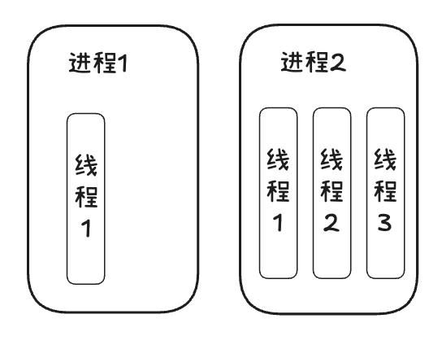
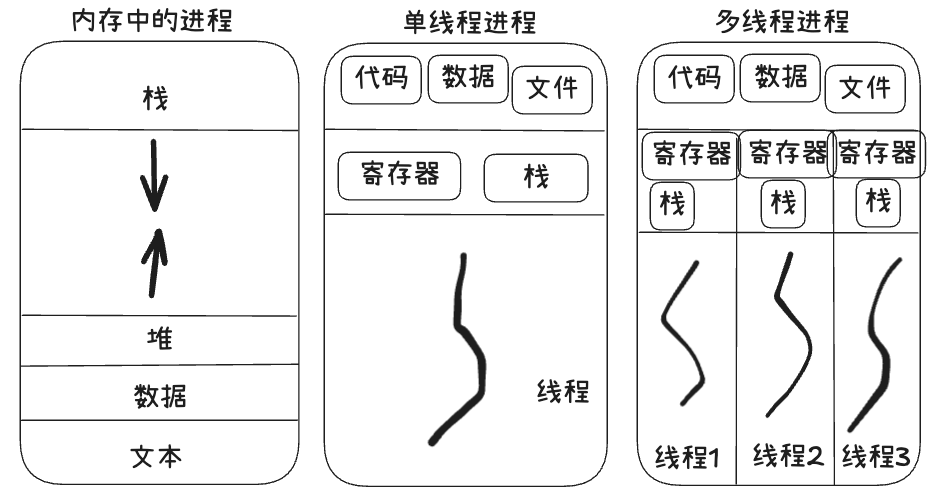
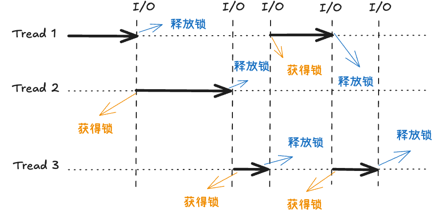

## 操作系统的线程
### 进程与线程的区别

- 进程
进程只能在一个时间干一件事，如果想同时干两件事或多件事，进程就无能为力了
进程在执行过程中如果阻塞，例如等待输入，整个过程就会挂起，即使进程中有些工作不依赖于输入的数据，也将无法执行
进程是资源分配的最小单位
- 线程
线程本质上是轻型进程，为了减少进程创建、撤销与切换时较大的时空开销
线程是CPU调度的最小单位
每个进程中至少有一个线程



> 可以归纳为以下四点：
1. 地址空间和其他资源共享(如打开文件):进程间相互独立，同一进程的各线程间共享。某进程内的线程在其他进程不可见
2. 通信 通信间通信IPC，线程间可以直接读写进程数据段（如全局变量）来进行通信，需要进程同步和互斥手段的辅助，以保持数据的一致性
3. 调度和切换
   线程上下文切换比进程上下文切换要快的多
4. 多线程操作系统中，进程不是一个可执行的实体
   
### 使用线程的实际场景
> 开启一个打字处理软件进程，该进程肯定需要办不止一件事情，比如监听键盘输入，处理文字，定时自动将文字保存到硬盘，这三个任务操作的都是同一块数据，因而不能使用多进程
> 只能在一个进程里并发的开启三个线程，如果是单线程，那就只能是，键盘输入时，不能处理文字和自动保存，自动保存时间又不能输入和处理文字

#### 内存中的线程


> 线程通常是有益的，但带来了不小的程序设计难度，线程的问题是
1. 父进程有多个进程，那么开启的子线程是否需要同样多的线程
2. 同一个进程中，一个线程关闭了文件，而另一个线程正准备往该文件写入内容，该如何处理？

因此，在多线程的代码中，需要更多心思来设计程序的逻辑、保护程序的数据


## python 中线程的使用
### 全局解释器GIL
> python代码的执行由python解释器的主循环控制，Python在设计之初就考虑到要在主循环中，同时只有一个线程在执行
> 虽然python解释器中可以运行多个线程，但是在任意时刻只有一个线程在解释器中运行
> 对python解释器的访问由全局解释器GIL来控制，正是这个锁能保证同一时刻只有一个线程在运行

1. 设置GIL
2. 切换到一个线程去执行
3. 运行指定数量的字节码指令或者线程主动让出控制（可以调用time.sleep(0)）
4. 把线程设置为睡眠状态
5. 解锁GIL
6. 再次重复以上所有步骤

### 创建线程
> 直接创建线程对象
```python
# create_process_demo1.py

from threading import Thread
import time

def task(name,delay):
    print(f"{name}开始执行")
    time.sleep(delay)
    print(f"{name}执行完毕")

if __name__ == '__main__':
    t1 = Thread(target=task,args=("线程A",2))
    t1.start()
    t1.join()

"""
输出
    线程A开始执行
    线程A执行完毕
"""
```

> 继承Thread 类
```python
from threading import Thread
import time

class MyThread(Thread):  # 通过子类化Thread 并重写 run()方法
    def __init__(self,name):
        super().__init__()
        self.name=name

    def run(self):
        print(f"{self.name}运行中...")
        time.sleep(1)

if __name__ == '__main__':
    t1 = MyThread("自定义线程")
    t1.start()

"""
输出
    自定义线程运行中...
"""
```
### 多线程
```python
import threading
import time,os


def task(name,delay):
    print(f"当前线程ID（Python标识符）:{threading.get_ident()}")
    print(f"线程对象标识符:{threading.current_thread().ident}")

    print(f"{name}-{os.getpid()} 开始执行")
    time.sleep(delay)
    print(f"{name}-{os.getpid()} 执行完毕")

if __name__ == '__main__':
    threads = [threading.Thread(target=task,args=(f"线程{i}",2)) for i in range(10)]
    for i in threads:
        i.start()
    for i in threads:
        i.join()
    print("主线程/主线程PID",os.getpid())

"""
输出
    当前线程ID（Python标识符）:6147387392
    线程对象标识符:6147387392
    线程0-8403 开始执行
    当前线程ID（Python标识符）:6164213760
    线程对象标识符:6164213760
    线程1-8403 开始执行
    当前线程ID（Python标识符）:6181040128
    线程对象标识符:6181040128
    线程2-8403 开始执行
    当前线程ID（Python标识符）:6197866496
    线程对象标识符:6197866496
    线程3-8403 开始执行
    当前线程ID（Python标识符）:6214692864
    线程对象标识符:6214692864
    线程4-8403 开始执行
    当前线程ID（Python标识符）:6231519232
    线程对象标识符:6231519232
    线程5-8403 开始执行
    当前线程ID（Python标识符）:6248345600
    线程对象标识符:6248345600
    线程6-8403 开始执行
    当前线程ID（Python标识符）:6265171968
    线程对象标识符:6265171968
    线程7-8403 开始执行
    当前线程ID（Python标识符）:6281998336
    线程对象标识符:6281998336
    线程8-8403 开始执行
    当前线程ID（Python标识符）:6298824704
    线程对象标识符:6298824704
    线程9-8403 开始执行
    线程1-8403 执行完毕
    线程0-8403 执行完毕
    线程5-8403 执行完毕
    线程8-8403 执行完毕
    线程2-8403 执行完毕
    线程6-8403 执行完毕
    线程7-8403 执行完毕线程3-8403 执行完毕
    
    线程9-8403 执行完毕
    线程4-8403 执行完毕
    主线程/主线程PID 8403
"""

```

### 常用方法

方法|含义
---|---
Thread.isAlive()|Thread类中的对象方法:返回线程是否活动的
Thread.getName()|返回线程名
Thread.setName()|设置线程名
threading.currentThread()|返回当前的线程变量
threading.enimerate()|返回一个包含正在运行的线程的列表
threading.activeCount()|返回正在运行的线程数量


```python
# common_methods.py

from threading import Thread
import threading
from multiprocessing import Process
import os,time


def work():
    time.sleep(3)
    print(threading.current_thread().name)


if __name__ == '__main__':
    t = Thread(target=work)
    t.start()

    print(threading.current_thread().name)
    print(threading.current_thread())
    print(threading.enumerate())
    print(threading.active_count())

    t.join()
    print("主线程/主进程")
    print(t.is_alive())

"""
输出
    MainThread
    <_MainThread(MainThread, started 8767971456)>
    [<_MainThread(MainThread, started 8767971456)>, <Thread(Thread-1 (work), started 6117076992)>]
    2
    Thread-1 (work)
    主线程/主进程
    False
"""
```

### 守护线程
> 守护线程是一种特殊的线程，它的生命周期与主线程（或者城市的主进程）绑定。当所有飞守护线程（或普通线程）结束时，无论守护线程是否完成任务，他都会被强制终止
> 这种机制常用于执行后台支持任务（如日志记录、心跳检测等），无需等待其完成

核心特性
- 依赖主线程存活：主线程结束时，守护线程立即终止（无论任务是否完成）
- 后台服务：用于非关键性人物，即使意外终止也不会影响程序逻辑
- 资源释放风险：守护线程被终止时，即使不会正常释放资源（如文件句柄、网络连接），需谨慎使用
```python
import threading,time


def background_task():
    while True:
        print("守护线程运行中...")
        time.sleep(1)

daemon_thread = threading.Thread(target=background_task)
daemon_thread.daemon = True
daemon_thread.start()

time.sleep(5)
print("主线程结束，守护线程将被终止")
"""
输出
    守护线程运行中...
    守护线程运行中...
    守护线程运行中...
    守护线程运行中...
    守护线程运行中...
    主线程结束，守护线程将被终止
"""
```
