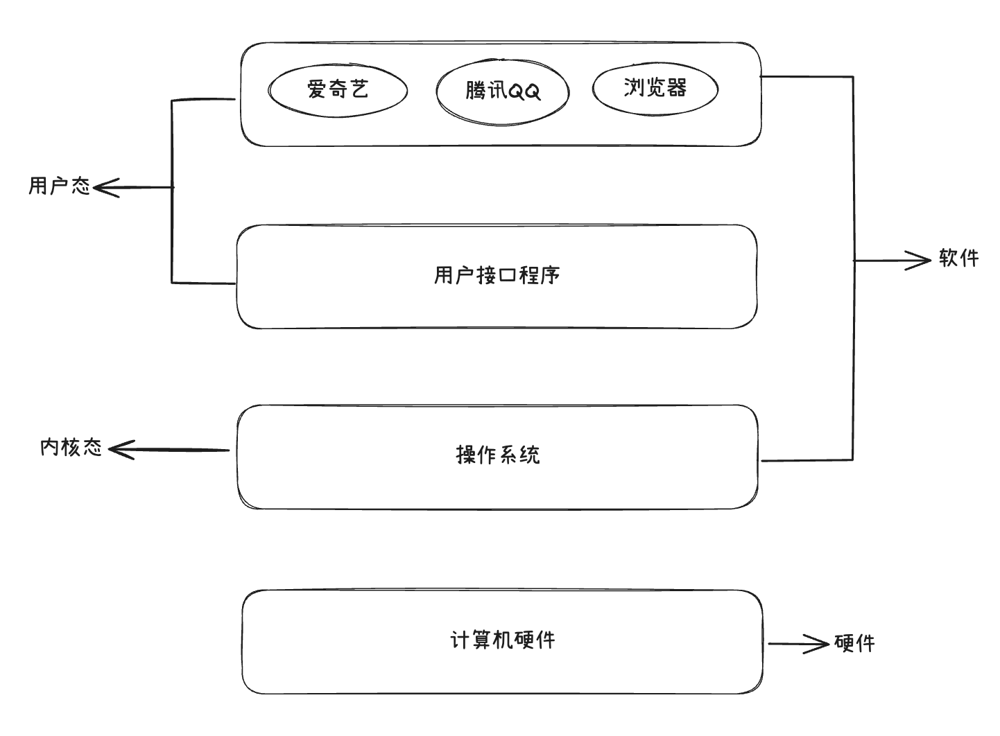

## 操作系统基础
> 操作系统（OperationSystem）是管理和控制计算机硬件和软件资源的计算机程序，是直接运行在”裸机“上的最基本的系统软件，任何其他软件都必须在操作系统的支持下才能运行

### 操作系统的核心功能

功能|说明
---|---
进程管理|创建、调度终止程序(进程/线程)
内存管理|分配和回收内存,虚拟内存支持
文件系统|管理文件的存储、读取、权限等
设备管理|驱动和控制外设(键盘、磁盘、打印机等)
用户界面|提供命令行(CLI)和图形界面(GUI)
安全和权限|控制用户访问资源的权限

## socket