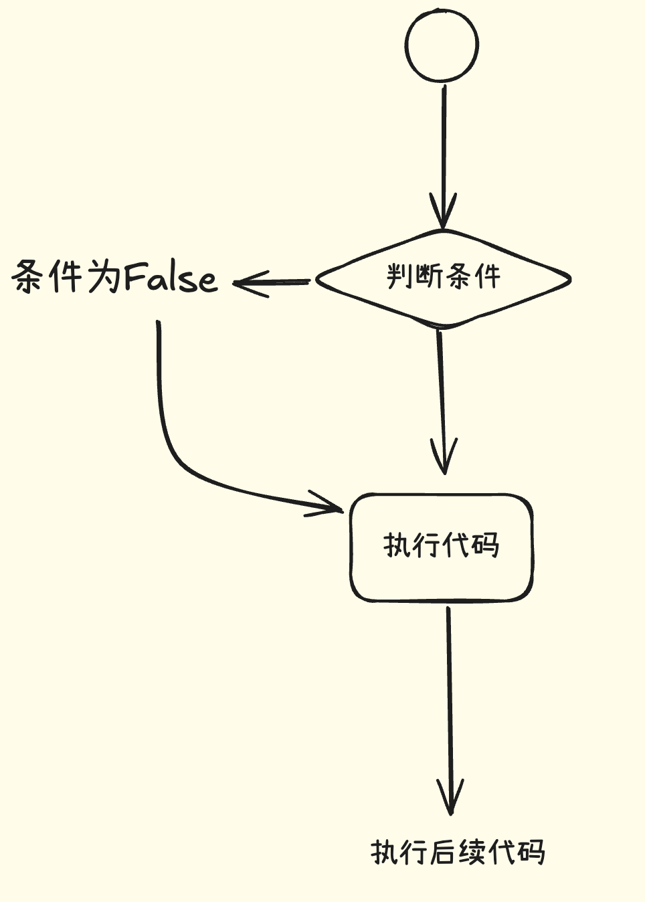

## 流程控制
### 判断语句（if）
1. 语法
```
if 条件:
    满足条件后执行的代码
```


2. 单分支判断例子
``` 
age = int(input("请输入你的年龄："))
if age >= 18:
    print("你已经成年了，可以去上网了")
    print("欢迎来到jeyng网吧")
"""
请输入你的年龄：21
你已经成年了，可以去上网了
欢迎来到jeyng网吧
"""
```
3. 双分支判断
```
age = int(input("请输入你的年龄："))
if age >= 18 and age< 50:
    print("您已成年，未来可期！")
else :
    print("学海无涯，学到老活到老")
"""
请输入你的年龄：19
您已成年，未来可期！

请输入你的年龄：66
学海无涯，学到老活到老！
"""
```
4. 多分支判断
```
if 条件1:
    满足条件的执行代码
elif 条件2:
    不满足条件1，满足条件2执行的代码
elif 条件3:
    不满足条件1条件2，满足条件3执行的代码
elif 条件....:
    ......
else 条件：
    不满足上面任意一个条件执行的代码
```
```
age = int(input("请输入你的年龄："))
if age < 18:
    print("您还未成年，人生刚刚开始！")
elif age>18 and age<30:
    print("您的未来充满不确定性，加油少年～")
else :
    print("东隅已逝，桑榆非晚")
"""
请输入你的年龄：19
您的未来充满不确定性，加油少年～

请输入你的年龄：16
您还未成年，人生刚刚开始！

请输入你的年龄：66
东隅已逝，桑榆非晚
"""
```

### 循环语句-while
1. 语法
```
while 条件:
    循环体
```
> 循环条件可以直接是True/False或者1/0，也可以是某个语句
循环条件为真，循环体执行；反之循环体不执行
2. 示例——猜数字小游戏
```
print("猜数字开始！")
number = 32
while(1):
    guess = int(input("请输入你猜的数字（0-100）"))
    if guess < number:
        print("你猜小啦")
        continue  # 加上continue使得循环从头开始，即重新开始循环
    elif guess > number:
        print("你猜大啦")
        continue
    break         # 两个判断语句均不满足，则结束循环

print("你猜对了！！！")
"""
猜数字开始！
请输入你猜的数字（0-100）1
你猜小啦
请输入你猜的数字（0-100）11
你猜小啦
请输入你猜的数字（0-100）123
你猜大啦
请输入你猜的数字（0-100）32
你猜对了！！！
"""
```
### 循环终止语句

1. break语句
用于完全结束一个循环，并跳出循环体，执行循环后面的语句

2. continue语句
和break类似，但continue仅仅终止本次循环，接着执行循环

3. while...else
> while后面的else指的是，当while循环正常执行完，中间没有被break中止的话，就会执行else后面的语句

#### 语法
```
while 条件:
    # 循环体
    if some_confition:
        break # 结束循环，且不执行else下方的代码
else:
    # 循环正常结束时执行的代码
```
```
# 寻找素数的示例
num = 10
i = 2

while i < num:
    if num % i == 0:
        print(f"{num} 不是素数，因为它可以被 {i} 整除。")
        break
    i += 1
else:
    print(f"{num} 是一个素数！")
```
### 循环语句-for
> for 循环：按照顺序循环可迭代对象的内容

#### 语法
```
for variable in iterable:
    循环体
    执行的代码
```

#### 遍历列表
```
fruits = ["apple", "banana", "cherry"]
for fruit in fruits:
    print(fruit)

"""
输出
apple
banana
cherry
"""
```

### range
> 指定范围，生成指定数字

```
for i in range(1,10):
    print(i)
for i in range(1,10,2):
    print(i)
for i in range(10,1,-2):
    print(i)
```
#### 案例1:石头剪刀布
#### 案例2:猜数字，猜错三次，自动退出
#### 案例3：石头剪刀布三局两胜（3:0/2:1）
