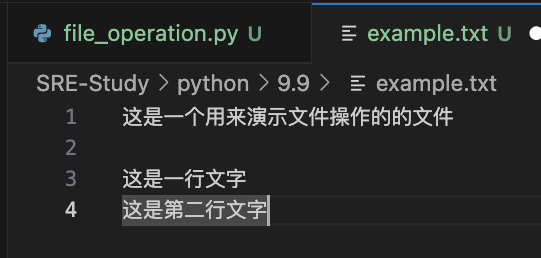

## python文件操作
> python 提供内置函数处理文件读写操作

### 文件类型
- 文本文件：可以使用文本编辑器查看，包含可读字符。一般使用UTF-8编码，如`.txt`,`.csv`等
- 二进制文件；以原始字节格式存储，需要使用专门软件查看。包含非文本数据如图像`.jpg\.png`、音频`.mp3`、视频文件`.mp4`等

### 文件操作的过程
打开文件--->读文件：将文件内容读入内存/写文件：将文件内容写入文件——>关闭文件

## 操作方法
### 打开文件
> 使用`open()`函数打开文件，并且返回文件对象
- 第一个参数是文件名（区分大小写），第二个参数是打开方式
- 文件存在则返回文件操作对象
- 文件不存在抛出异常

`f = open("文件名"，"访问方式")`

1. 文件路径
- 绝对路径
从根路径开始描述文件的位置，如`F:\\技术文件\安装包\zabbix压缩包`，具有唯一性，不会出错，无论写到哪里都能准确找到文件的位置
- 相对路径
针对当前文件进行文件定位，容易出错，需要对文件比较熟悉

2. 文件访问方式（以不同的模式打开）
> 以下表格仅针对文本文件

访问方式|说明|备注
---|---|---
r|只读方式打开文件|默认模式,文件指针放在文件的开头;文件不存在,抛出异常
w|只写方式打开文件|文件存在会被覆盖;文件不存在则创建新文件
a|追加方式打开文件|文件已存在,文件指针放在文件的结尾;文件不存在,创建新文件进行写入
r+|读写方式打开文件|文件指针放在文件的开头;文件不存在抛出异常
w+|读写方式打开文件|文件存在会被覆盖;文件不存在,则会创建新文件
a+|以读写方式打开文件|若文件存在,文件指针将会放在文件的结尾;文件不存在,创建新文件进行写入
r+b|二进制读写方式打开|文件指针在开头,可读可写,文件必须存在
w+b|二进制读写方式打开|文件指针在开头,先清空再写入;不存在则创建
a+b|二进制读写方式打开|文件指针在末尾,追加写入,可读全文,不存在则创建

> 对于非文本文件,只能使用`b模式`,表示以`byte`方式操作,读取到的内容是字节类型,写入时也需提供字节类型,不能指定编码

#### 文件编码
`f = open()`是有操作系统打开文件,如果我们没有指定编码,那么打开文件的默认编码取决于操作系统,操作系统会用自己的默认编码去打开文件(Windows下是GBK,Linux下是UTF-8)
`f = open('example.txt','r',encoding='utf-8')`

### 读取文件
-  `read(size)`
读取指定大小的内容,不指定则读取全部内容
-  `readline()`
读取一行
-  `readlines`
读取所有行并返回一个列表

#### 示例见`file_operation.py`文件

```
# file_operation.py
import os

print("Current working directory:", os.getcwd()) # 确认当前工作路径

file = open('SRE-Study/python/9.9/example.txt','r')

content = file.read()
print(content)
line = file.readline()
print(line,"+++++")
lines = file.readlines()
print(lines,"----")

"""
输出
Current working directory: /Users/jeyng/Desktop/Git_Root
这是一个用来演示文件操作的的文件
+
这是一行文字
这是第二行文字
 +++++
[] ----
"""
```
> *read()执行完后会把文件指针放在文件的结尾*,所以第一次执行完read()后,第二次和第三次read()读不到内容
#### 文件指针操作
> 用seek()操作指针,来改变文件指针(光标)的位置
1. 语法
`file.seek(offset,whence)`
    1. offset 
要移动的字节数
    2. whence
指定偏移量的基准位置
        1. 0(默认值):从文件开头开始计算
        2. 1:从当前位置开始计算
        3. 3:从文件末尾开始计算
2. 示例
见`file_operation.py`


#### 按行读取文件内容
- `read()`默认把文件内容一次性读到内存
- `readline()`可以一次读取一行内容

##### 示例
见`file_operation.py`
1. 通过循环按行读取文件所有内容
2. 通过for循环遍历按行读取文件所有内容 


### 写入内容
> 可以对文件对象调用`write()`实现写入内容

1. 语法
`file.write()`

2. 示例:日记记录
```
file = open('diary.txt','a',encoding='utf-8')
content = input("请输入新加入的内容\n")
file.write(content+"\n")
print("日记已经保存")

file.close()
"""
输出

请输入新加入的内容
请输入新加入的内容
请输入新加入的内容
请输入新加入的内容
123
日记已经保存
"""
```


### 关闭文件
> 使用`close()`关闭文件,释放系统资源,防止文件一直被占用

`file.close()`

### with结构
> 使用`with`语句自动管理文件的打开和关闭,避免忘记关闭文件

```
with open('diary.txt','r') as file:
    content = file.read()
```

### 其他文件操作
```
class CustomFile:
    def __init__(self, *args, **kwargs):
        """初始化文件对象."""
        pass

    @staticmethod
    def __new__(*args, **kwargs):
        """创建并返回一个新的对象."""
        pass

    def close(self, *args, **kwargs):
        """关闭文件."""
        pass

    def fileno(self, *args, **kwargs):
        """返回文件描述符."""
        pass

    def flush(self, *args, **kwargs):
        """刷新文件内部缓冲区."""
        pass

    def isatty(self, *args, **kwargs):
        """判断文件是否是一个终端设备."""
        pass

    def read(self, *args, **kwargs):
        """读取指定字节的数据."""
        pass

    def readable(self, *args, **kwargs):
        """检查文件是否可读."""
        pass

    def readline(self, *args, **kwargs):
        """仅读取一行数据."""
        pass

    def seek(self, *args, **kwargs):
        """移动文件指针到指定位置."""
        pass

    def seekable(self, *args, **kwargs):
        """检查指针是否可操作."""
        pass

    def tell(self, *args, **kwargs):
        """获取当前指针位置."""
        pass

    def truncate(self, *args, **kwargs):
        """截断文件，仅保留指定之前的数据."""
        pass

    def writable(self, *args, **kwargs):
        """检查文件是否可写."""
        pass

    def write(self, *args, **kwargs):
        """写入内容到文件."""
        pass

    def __next__(self, *args, **kwargs):
        """实现迭代器的 next() 方法."""
        pass

    def __repr__(self, *args, **kwargs):
        """返回文件对象的字符串表示."""
        pass

    def __getstate__(self, *args, **kwargs):
        """自定义对象的序列化状态."""
        pass
```

|方法名	|说明
|---|---
__init__	|初始化文件对象的方法。通常在这里设置文件的基本属性
__new__	|静态方法，用于创建新的对象实例
close	|关闭文件，释放系统资源
fileno	|返回文件描述符，通常用于与底层操作系统交互
flush	|刷新文件的内部缓冲区，将未写入的数据写入文件
isatty	|判断文件是否是一个终端设备（tty），用于检查文件是否连接到一个用户界面
read	|读取指定字节的数据，可以用来读取文件内容
readable|	检查文件对象是否可读
readline|	读取文件中的一行数据，常用于逐行读取文件内容
seek	|移动文件指针到指定位置，允许在文件中随机访问
seekable|	检查文件指针是否可操作，确定文件是否支持随机访问
tell	|返回当前文件指针的位置
truncate|	截断文件，只保留指定位置之前的数据
writable|	检查文件对象是否可写
write	|向文件写入内容
__next__|	实现迭代器的 next() 方法，用于支持迭代访问文件的内容
__repr__|	返回文件对象的字符串表示，通常用于调试
__getstate__|	自定义对象的序列化状态，用于存储和恢复对象的状态

